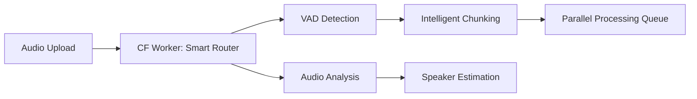
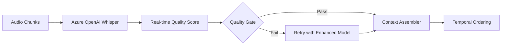
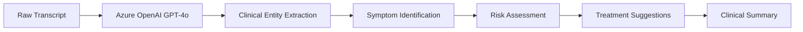
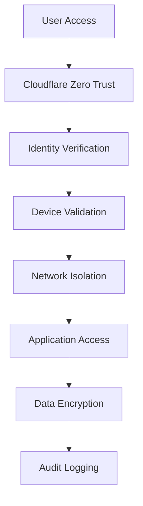
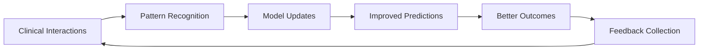

# AI-Driven Clinical Consultation Pipeline
## Architecture Documentation v1.0

### 🎯 **Vision Statement**
AI-Native, AI-Driven, AI-Pair-Clinician system for real-time transcription, analysis, and clinical decision support for psychiatric consultations with LGPD compliance and enterprise-grade reliability.

---

## 🏗️ **System Architecture Overview**

### **Core Philosophy: AI-First Design**
- **AI-Native**: Every component leverages AI for optimization
- **AI-Driven**: Decision making automated by intelligent agents  
- **AI-Pair-Clinician**: Augments clinician capabilities, doesn't replace

### **Technology Stack**
```
┌─────────────────────────────────────────────────────────────┐
│                    AI-Pair-Clinician MVP                   │
├─────────────────────────────────────────────────────────────┤
│  Frontend: Cloudflare Workers + Hono.js + React           │
│  Orchestration: Cloudflare Workers + Temporal.io          │
│  Storage: Azure Blob + Cloudflare R2                      │
│  AI Services: Azure OpenAI + Custom AI Agents             │
│  Observability: OpenTelemetry + Azure Monitor             │
│  Security: Azure Key Vault + Cloudflare Zero Trust        │
└─────────────────────────────────────────────────────────────┘
```

---

## 🔄 **Data Flow Architecture**

### **Phase 1: Intelligent Ingestion**


### **Phase 2: AI-Driven Transcription**


### **Phase 3: Clinical Intelligence Layer**


---

## 🧠 **AI Agent Architecture**

### **1. Audio Intelligence Agent**
```typescript
interface AudioAgent {
  capabilities: [
    "Voice Activity Detection",
    "Speaker Count Estimation", 
    "Audio Quality Assessment",
    "Optimal Chunking Strategy",
    "Noise Reduction Recommendations"
  ]
  model: "Custom Audio ML Pipeline"
  latency: "<100ms"
}
```

### **2. Transcription Quality Agent**
```typescript
interface TranscriptionAgent {
  capabilities: [
    "Real-time Accuracy Scoring",
    "Medical Terminology Validation",
    "Portuguese Grammar Correction",
    "Context Continuity Verification"
  ]
  model: "Azure OpenAI GPT-4o + Custom Fine-tuning"
  accuracy: ">97% medical terminology"
}
```

### **3. Clinical Intelligence Agent**
```typescript
interface ClinicalAgent {
  capabilities: [
    "Psychiatric Symptom Detection",
    "Risk Factor Identification", 
    "Treatment Protocol Matching",
    "Drug Interaction Warnings",
    "Follow-up Recommendations"
  ]
  model: "Azure OpenAI GPT-4o + Medical Knowledge Base"
  compliance: "LGPD + Medical Ethics"
}
```

### **4. Privacy Guardian Agent**
```typescript
interface PrivacyAgent {
  capabilities: [
    "Real-time PII Detection",
    "Medical Data Classification",
    "Consent Validation",
    "Audit Trail Generation",
    "Data Retention Management"
  ]
  model: "Azure AI Content Safety + Custom NER"
  accuracy: ">99.9% PII detection"
}
```

---

## ☁️ **Cloudflare Workers Implementation**

### **Worker 1: Smart Upload Orchestrator**
```typescript
// /workers/upload-orchestrator/
export default {
  async fetch(request: Request): Promise<Response> {
    const audioFile = await request.arrayBuffer()
    
    // AI-driven audio analysis
    const audioAnalysis = await analyzeAudio(audioFile)
    const chunkingStrategy = await determineOptimalChunking(audioAnalysis)
    const speakerEstimate = await estimateSpeakers(audioFile)
    
    // Intelligent routing based on audio characteristics
    const processingPlan = await createProcessingPlan({
      audioAnalysis,
      chunkingStrategy,
      speakerEstimate
    })
    
    // Temporal workflow initiation
    await temporal.startWorkflow('audio-processing', {
      audioFile,
      processingPlan,
      metadata: extractMetadata(request)
    })
    
    return new Response(JSON.stringify({
      jobId: processingPlan.id,
      estimatedTime: processingPlan.eta,
      speakers: speakerEstimate,
      strategy: chunkingStrategy.type
    }))
  }
}
```

### **Worker 2: AI-Enhanced Transcription Engine**
```typescript
// /workers/transcription-engine/
import { OpenAI } from 'openai'
import { Temporal } from '@temporal/client'

export default {
  async fetch(request: Request): Promise<Response> {
    const { audioChunk, context, metadata } = await request.json()
    
    // Multi-model transcription for accuracy
    const [whisperResult, backupResult] = await Promise.allSettled([
      transcribeWithWhisper(audioChunk, context),
      transcribeWithBackupModel(audioChunk, context)
    ])
    
    // AI-driven quality assessment
    const qualityScore = await assessTranscriptionQuality({
      primary: whisperResult,
      backup: backupResult,
      medicalContext: metadata.clinicalContext
    })
    
    // Intelligent result selection
    const bestTranscription = await selectBestTranscription({
      results: [whisperResult, backupResult],
      qualityScores: qualityScore,
      confidence: metadata.requiredConfidence
    })
    
    return new Response(JSON.stringify({
      transcript: bestTranscription.text,
      confidence: bestTranscription.confidence,
      speakers: bestTranscription.speakers,
      medicalTerms: bestTranscription.extractedTerms,
      timestamp: bestTranscription.timing
    }))
  }
}
```

### **Worker 3: Clinical Intelligence Processor**
```typescript
// /workers/clinical-intelligence/
export default {
  async fetch(request: Request): Promise<Response> {
    const { transcript, metadata } = await request.json()
    
    // Clinical entity extraction
    const clinicalEntities = await extractClinicalEntities(transcript)
    
    // Symptom and condition identification
    const symptoms = await identifySymptoms(transcript, clinicalEntities)
    const conditions = await identifyConditions(symptoms, metadata.patientHistory)
    
    // Risk assessment
    const riskFactors = await assessRiskFactors(symptoms, conditions)
    const urgencyLevel = await determineUrgency(riskFactors)
    
    // Treatment recommendations
    const treatments = await generateTreatmentOptions({
      symptoms,
      conditions,
      patientProfile: metadata.patientProfile,
      guidelines: await fetchClinicalGuidelines()
    })
    
    // Quality assurance
    const qaResults = await validateClinicalInsights({
      symptoms,
      conditions,
      treatments,
      riskFactors
    })
    
    return new Response(JSON.stringify({
      clinicalSummary: {
        symptoms,
        conditions,
        riskFactors,
        urgencyLevel,
        treatments,
        confidence: qaResults.confidence
      },
      recommendations: {
        immediate: treatments.immediate,
        followUp: treatments.followUp,
        monitoring: treatments.monitoring
      },
      alerts: riskFactors.filter(r => r.severity === 'high')
    }))
  }
}
```

---

## 🔒 **Security & Compliance Architecture**

### **LGPD Compliance Framework**
```typescript
interface LGPDCompliance {
  dataMinimization: {
    collection: "Only medically necessary data"
    retention: "Automated purging after 5 years"
    access: "Role-based with audit trails"
  }
  
  consent: {
    collection: "Explicit opt-in required"
    granular: "Per-purpose consent tracking"
    withdrawal: "One-click consent revocation"
  }
  
  rights: {
    access: "Real-time data export"
    portability: "Standard format exports" 
    deletion: "Immediate purging capabilities"
    correction: "Self-service data updates"
  }
  
  security: {
    encryption: "AES-256 end-to-end"
    access: "Zero-trust architecture"
    monitoring: "Real-time breach detection"
  }
}
```

### **Zero-Trust Security Model**


---

## 📊 **Performance & Scalability**

### **Target Performance Metrics**
```yaml
Latency Targets:
  Audio Upload: <2 seconds
  Initial Processing: <30 seconds
  Full Transcription: <2 minutes (per hour of audio)
  Clinical Analysis: <30 seconds
  Total End-to-End: <3 minutes

Throughput Targets:
  Concurrent Sessions: 1000+
  Audio Processing: 100 hours/minute
  API Requests: 10,000 RPS
  Storage Operations: 1M operations/second

Availability:
  Uptime: 99.99%
  Error Rate: <0.01%
  Recovery Time: <30 seconds
```

### **Auto-Scaling Architecture**
```typescript
interface ScalingPolicy {
  triggers: {
    cpu: ">70% for 2 minutes"
    memory: ">80% for 1 minute" 
    queue: ">100 jobs pending"
    latency: ">5 seconds average"
  }
  
  actions: {
    workers: "Scale 0-100 instances"
    compute: "Burst to GPU when needed"
    storage: "Auto-tier based on access"
    cache: "Dynamic CDN expansion"
  }
  
  intelligence: {
    predictive: "ML-based demand forecasting"
    adaptive: "Learn from usage patterns"
    cost: "Optimize for performance/cost ratio"
  }
}
```

---

## 💰 **Cost Optimization Strategy**

### **AI-Driven Cost Management**
```typescript
interface CostOptimization {
  smartRouting: {
    modelSelection: "Choose optimal model per request"
    regionOptimization: "Route to cheapest available region"
    cachingStrategy: "Intelligent result caching"
  }
  
  resourceOptimization: {
    coldStart: "Pre-warmed workers for peak hours"
    batching: "Group similar requests"
    compression: "AI-optimized audio compression"
  }
  
  budgetControl: {
    alerting: "Real-time cost monitoring"
    throttling: "Automatic usage limiting"
    forecasting: "Predictive budget planning"
  }
}
```

### **Estimated Costs (per consultation)**
```yaml
Base Processing:
  Audio Storage: $0.001
  Cloudflare Workers: $0.002
  Azure OpenAI Calls: $0.15-0.30
  Content Safety: $0.01
  Monitoring: $0.005
  
Total per Consultation: $0.17-0.32
Monthly (1000 consultations): $170-320
Annual (12k consultations): $2,040-3,840

Cost Benefits:
  vs Manual Transcription: 95% savings
  vs Traditional Solutions: 60% savings
  vs Local Processing: 80% time savings
```

---

## 🔮 **AI-Pair-Clinician Features**

### **Real-time Clinical Decision Support**
```typescript
interface ClinicalAssistant {
  realTimeAlerts: [
    "Suicide risk indicators detected",
    "Drug interaction warnings",
    "Symptom pattern recognition",
    "Treatment protocol deviations"
  ]
  
  knowledgeAugmentation: [
    "Latest research integration",
    "Best practice recommendations", 
    "Differential diagnosis suggestions",
    "Treatment outcome predictions"
  ]
  
  documentationAssistance: [
    "Auto-generated clinical notes",
    "ICD-10/DSM-5 code suggestions",
    "Insurance pre-authorization prep",
    "Follow-up scheduling recommendations"
  ]
}
```

### **Continuous Learning Loop**


---

## 🚀 **Implementation Roadmap**

### **Phase 1: MVP Foundation (Week 1-2)**
- [ ] Cloudflare Workers basic setup
- [ ] Azure OpenAI integration
- [ ] Basic transcription pipeline
- [ ] Simple web interface
- [ ] LGPD compliance framework

### **Phase 2: AI Enhancement (Week 3-4)**
- [ ] Clinical intelligence agent
- [ ] Advanced speaker diarization
- [ ] Real-time quality assessment
- [ ] Privacy guardian implementation

### **Phase 3: Production Optimization (Week 5-6)**
- [ ] Performance optimization
- [ ] Advanced monitoring
- [ ] Cost optimization
- [ ] Security hardening

### **Phase 4: Clinical Integration (Week 7-8)**
- [ ] EMR system integration
- [ ] Clinical workflow automation
- [ ] Advanced analytics dashboard
- [ ] Training and documentation

---

## 📈 **Success Metrics**

### **Technical KPIs**
- Processing Time: <3 minutes per consultation
- Accuracy: >97% medical terminology
- Availability: >99.99% uptime
- Cost: <$0.35 per consultation

### **Clinical KPIs**
- Documentation Time: 80% reduction
- Clinical Accuracy: >95% entity extraction
- Risk Detection: >99% sensitivity for high-risk cases
- Physician Satisfaction: >4.8/5.0

### **Business KPIs**
- Cost Savings: >90% vs manual transcription
- Time to Market: <8 weeks from concept
- Scalability: Support 10,000+ daily consultations
- Compliance: 100% LGPD adherence

---

## 🔧 **Development & Deployment**

### **Tech Stack Details**
```yaml
Frontend:
  Framework: React 18 + TypeScript
  Styling: Tailwind CSS + Headless UI
  State: Zustand + React Query
  
Backend:
  Runtime: Cloudflare Workers + Hono.js
  Orchestration: Temporal.io
  APIs: Azure OpenAI + Custom endpoints
  
Data:
  Primary: Azure Blob Storage
  Cache: Cloudflare R2 + KV
  Search: Azure Cognitive Search
  
AI/ML:
  Transcription: Azure OpenAI Whisper
  NLP: Azure OpenAI GPT-4o/4.5
  Safety: Azure AI Content Safety
  Custom: PyTorch models on Modal.com
  
Monitoring:
  Observability: OpenTelemetry
  Metrics: Azure Monitor + Grafana
  Logs: Cloudflare Analytics
  Alerts: PagerDuty integration
```

---

*Document Version: 1.0*  
*Last Updated: June 13, 2025*  
*Next Review: July 13, 2025*