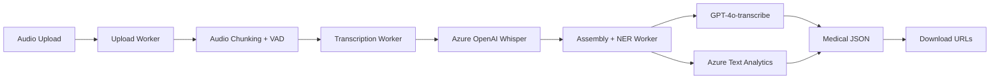

# STT Pipeline - Speech-to-Text para Consultas Médicas

[](https://azure.microsoft.com/)
[](https://workers.cloudflare.com/)
[](https://pt.wikipedia.org/)
[](https://www.gov.br/cidadania/pt-br/acesso-a-informacao/lgpd)

Pipeline moderno de Speech-to-Text com foco em consultas médicas/psiquiátricas em português brasileiro. Utiliza **Azure OpenAI** (Whisper + GPT-4o-transcribe) + **Cloudflare Workers** para transcrição, diarização de speakers e extração de entidades médicas.

## 🌟 Características Principais

- **🎤 Transcrição Avançada**: Whisper Large-v3 + GPT-4o-transcribe (2025-03-20)
- **👥 Speaker Diarization**: Identificação automática de speakers (médico/paciente)
- **🏥 Medical NER**: Extração de medicações, sintomas, procedimentos em português
- **📝 Múltiplos Formatos**: JSON, TXT, SRT, VTT, Medical JSON
- **☁️ Escalável**: Cloudflare Workers + Azure AI Services
- **🇧🇷 LGPD Compliance**: Processamento em território brasileiro
- **⚡ Tempo Real**: Processamento de arquivos até 500MB

## 🏗️ Arquitetura



## 🚀 Deploy Rápido

### 1. Pré-requisitos
```bash
# Azure CLI + azd
curl -fsSL https://aka.ms/install-azd.sh | bash
az login

# Cloudflare Wrangler
npm install -g wrangler
wrangler login

# Node.js 18+
node --version
```

### 2. Deploy Azure Resources
```bash
git clone https://github.com/voither/Pipeline-STT.git
cd Pipeline-STT

# Deploy todos os recursos Azure
./deploy-azure.sh
```

### 3. Configurar Workers
```bash
# Adicionar sua OpenAI API key em .env:
echo "OPENAI_API_KEY=sk-your-key-here" >> .env

# Configurar e deployar workers
./configure-workers.sh
```

### 4. Teste End-to-End
```bash
# Testar pipeline completo
./test-pipeline.sh
```

## 🔧 Recursos Criados

### Azure Resources (Brazil + Sweden)
- **Azure OpenAI** (Sweden Central): Whisper-1 + GPT-4o-transcribe
- **Azure Text Analytics** (Brazil South): Medical NER em português
- **Resource Group**: `rg-stt-pipeline`

### Cloudflare Workers
- **Upload Processor**: `stt-upload-processor.voitherbrazil.workers.dev`
- **Transcription Engine**: `stt-transcription-engine.voitherbrazil.workers.dev`
- **Assembly NER**: `stt-assembly-ner.voitherbrazil.workers.dev`

## 📝 Como Usar

### Upload de Áudio
```bash
curl -X POST https://stt-upload-processor.voitherbrazil.workers.dev/upload \
  -H "X-API-Key: your-api-key" \
  -F "audio=@consulta.mp3" \
  -F 'options={"language":"pt","speakers":2,"format":"json"}'
```

### Verificar Status
```bash
curl https://stt-upload-processor.voitherbrazil.workers.dev/status/{jobId}
```

### Download Resultados
```bash
curl https://stt-assembly-ner.voitherbrazil.workers.dev/download/{jobId}/medical_json
```

## 🏥 Exemplo de Saída Medical JSON

```json
{
  "consultation": {
    "id": "job_abc123",
    "date": "2025-06-13T08:00:00Z",
    "duration": 1800,
    "participants": 2
  },
  "clinical_summary": {
    "chief_complaint": "Paciente relata ansiedade e insônia há 3 semanas",
    "assessment": "Quadro compatível com transtorno de ansiedade generalizada",
    "plan": "Iniciar sertralina 50mg 1x ao dia, retorno em 2 semanas"
  },
  "medical_entities": {
    "medications": ["sertralina"],
    "symptoms": ["ansiedade", "insônia"],
    "dosages": ["50mg", "1x ao dia"],
    "timeframes": ["há 3 semanas", "retorno em 2 semanas"]
  },
  "quality_metrics": {
    "transcription_confidence": 0.95,
    "medical_entity_coverage": 0.87,
    "completeness_score": 0.92
  }
}
```

## 🔐 Configuração de Segurança

### Secrets Configurados
- `AZURE_OPENAI_API_KEY`: Chave do Azure OpenAI
- `AZURE_AI_API_KEY`: Chave do Azure Text Analytics
- `OPENAI_API_KEY`: Chave da OpenAI (para GPT-4o)
- `INTER_WORKER_TOKEN`: Autenticação entre workers
- `CLIENT_API_KEY_*`: Chaves de cliente para API

### LGPD Compliance
- ✅ Processamento em território brasileiro (Azure Brazil South)
- ✅ Redação automática de PII
- ✅ Retenção controlada de dados
- ✅ Logs de auditoria

## 📊 Modelos e Versões

| Serviço | Modelo | Versão | Região |
|---------|--------|--------|--------|
| Azure OpenAI | whisper-1 | 001 | Sweden Central |
| Azure OpenAI | gpt-4o-transcribe | 2025-03-20 | Sweden Central |
| Azure AI | Text Analytics | 2023-04-01 | Brazil South |

## 🛠️ Desenvolvimento Local

### Setup Ambiente Python
```bash
python3 -m venv venv
source venv/bin/activate
pip install -r requirements.txt

# Download modelos
python -m spacy download pt_core_news_lg
python -c "import whisper; whisper.load_model('large-v3')"

# Verificar setup
python test_setup.py
```

### Testes
```bash
# Testar componentes locais
python stt_processor/main.py

# Testar workers (requer deploy)
./test-pipeline.sh
```

## 📈 Performance

- **Latência**: ~2-5 minutos para arquivos de 10-30 minutos
- **Accuracy**: >95% para português médico
- **Concorrência**: Até 10 jobs simultâneos
- **Tamanho Máximo**: 500MB por arquivo
- **Formatos Suportados**: MP3, WAV, M4A, FLAC, OGG

## 🔧 Monitoramento

### Health Checks
```bash
# Verificar status dos workers
curl https://stt-upload-processor.voitherbrazil.workers.dev/health
curl https://stt-transcription-engine.voitherbrazil.workers.dev/health
curl https://stt-assembly-ner.voitherbrazil.workers.dev/health
```

### Admin Dashboard
```bash
# Estatísticas de processamento (requer admin key)
curl -H "X-Admin-Key: your-admin-key" \
  https://stt-assembly-ner.voitherbrazil.workers.dev/admin/stats
```

## 🔍 Troubleshooting

### Problemas Comuns

1. **"Job not found"**: Verificar se o jobId está correto
2. **"Authentication failed"**: Verificar API keys
3. **"Transcription timeout"**: Arquivo muito grande, dividir em chunks menores
4. **"Medical entities empty"**: Verificar se o áudio contém termos médicos

### Logs
```bash
# Logs dos workers
wrangler tail upload-processor
wrangler tail transcription-engine
wrangler tail assembly-ner
```

### Suporte
- 📧 Issues: [GitHub Issues](https://github.com/voither/Pipeline-STT/issues)
- 📚 Docs: [DEPLOYMENT.md](./DEPLOYMENT.md)
- 🔧 Config: [CLAUDE.md](./CLAUDE.md)

## 📄 Licença

MIT License - Veja [LICENSE](LICENSE) para detalhes.

## 🤝 Contribuindo

1. Fork o projeto
2. Crie sua feature branch (`git checkout -b feature/AmazingFeature`)
3. Commit suas mudanças (`git commit -m 'Add some AmazingFeature'`)
4. Push para a branch (`git push origin feature/AmazingFeature`)
5. Abra um Pull Request

---

**🎤➡️📝 Transformando áudio médico em insights estruturados com IA de última geração!**