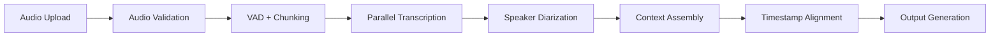

# Speech-to-Text Pipeline Architecture
## Pure STT Solution - v1.0

### 🎯 **Core Mission**
High-performance Speech-to-Text pipeline with speaker diarization for Brazilian Portuguese audio files. **NO clinical analysis** - pure transcription only.

---

## 🏗️ **System Architecture Overview**

### **Single Responsibility: Audio → Text**
```
┌─────────────────────────────────────────────────────────────┐
│                    STT Pipeline Only                       │
├─────────────────────────────────────────────────────────────┤
│  Input: Audio files (mp3, wav, m4a, etc.)                 │
│  Processing: Transcription + Speaker ID                    │  
│  Output: Structured transcript with timestamps             │
│  Quality: >95% accuracy for Portuguese BR                  │
│  Speed: <3min processing for 1h audio                      │
└─────────────────────────────────────────────────────────────┘
```

---

## 🔄 **STT Data Flow**

### **Pure Transcription Pipeline**


### **Input → Output Transformation**
```yaml
Input:
  - Audio files (mp3, wav, m4a, flac)
  - Max size: 500MB
  - Languages: Portuguese BR (primary)

Processing:
  - Voice Activity Detection
  - Smart chunking (25MB segments)
  - Whisper Large-v3 transcription
  - Speaker diarization
  - Temporal alignment

Output:
  - Plain text transcript
  - Speaker-separated transcript
  - Timestamped segments
  - Confidence scores
  - Multiple formats (JSON, TXT, SRT)
```

---

## ☁️ **Cloudflare Workers Implementation**

### **Worker 1: Upload & Chunking**
```typescript
// /workers/audio-processor/
interface AudioUpload {
  file: ArrayBuffer
  metadata: {
    filename: string
    duration?: number
    sampleRate?: number
  }
}

export default {
  async fetch(request: Request): Promise<Response> {
    const audioData = await parseAudioUpload(request)
    
    // Validate audio file
    const validation = await validateAudio(audioData)
    if (!validation.valid) {
      return new Response(JSON.stringify({
        error: validation.error,
        supportedFormats: ['mp3', 'wav', 'm4a', 'flac']
      }), { status: 400 })
    }
    
    // Voice Activity Detection
    const vadResult = await detectVoiceActivity(audioData.file)
    
    // Smart chunking based on VAD
    const chunks = await createOptimalChunks({
      audio: audioData.file,
      vadSegments: vadResult.segments,
      maxChunkSize: 25 * 1024 * 1024 // 25MB
    })
    
    // Upload chunks to Azure Blob
    const chunkIds = await uploadChunksToBlob(chunks)
    
    // Start transcription workflow
    const jobId = await initiateTranscription({
      chunkIds,
      metadata: audioData.metadata,
      vadResult
    })
    
    return new Response(JSON.stringify({
      jobId,
      chunks: chunks.length,
      estimatedTime: calculateProcessingTime(audioData.metadata.duration),
      status: 'processing'
    }))
  }
}
```

### **Worker 2: Transcription Engine**
```typescript
// /workers/transcription/
interface TranscriptionJob {
  chunkId: string
  audioBlob: string
  context?: string
  previousSpeakers?: string[]
}

export default {
  async fetch(request: Request): Promise<Response> {
    const job: TranscriptionJob = await request.json()
    
    // Download audio chunk from Azure Blob
    const audioChunk = await downloadFromBlob(job.audioBlob)
    
    // Transcribe with Azure OpenAI Whisper
    const transcription = await transcribeWithWhisper({
      audio: audioChunk,
      language: 'pt',
      model: 'whisper-1',
      response_format: 'verbose_json',
      timestamp_granularities: ['segment', 'word']
    })
    
    // Speaker diarization
    const speakerResult = await performSpeakerDiarization({
      audio: audioChunk,
      transcription: transcription.segments,
      previousSpeakers: job.previousSpeakers
    })
    
    // Align speakers with transcript
    const alignedResult = await alignSpeakersWithText({
      transcription: transcription.segments,
      speakers: speakerResult.speakers,
      words: transcription.words
    })
    
    return new Response(JSON.stringify({
      chunkId: job.chunkId,
      transcript: alignedResult.text,
      segments: alignedResult.segments,
      speakers: alignedResult.speakers,
      confidence: transcription.confidence,
      processing_time: transcription.processing_time
    }))
  }
}
```

### **Worker 3: Assembly & Medical NER**
```typescript
// /workers/assembly/
interface AssemblyJob {
  jobId: string
  chunks: TranscriptionResult[]
  originalMetadata: AudioMetadata
}

interface MedicalEntities {
  medications: Array<{text: string, start_time: number, confidence: number}>
  symptoms: Array<{text: string, start_time: number, confidence: number}>
  procedures: Array<{text: string, start_time: number, confidence: number}>
  anatomical: Array<{text: string, start_time: number, confidence: number}>
  dosages: Array<{text: string, start_time: number, confidence: number}>
  timeframes: Array<{text: string, start_time: number, confidence: number}>
  conditions: Array<{text: string, start_time: number, confidence: number}>
}

export default {
  async fetch(request: Request): Promise<Response> {
    const job: AssemblyJob = await request.json()
    
    // Sort chunks by temporal order
    const sortedChunks = sortChunksByTimestamp(job.chunks)
    
    // Merge transcriptions maintaining speaker continuity
    const mergedTranscript = await mergeTranscriptions({
      chunks: sortedChunks,
      speakerMapping: await createSpeakerMapping(sortedChunks)
    })
    
    // Medical Entity Recognition
    const medicalEntities = await extractMedicalEntities({
      transcript: mergedTranscript.full_text,
      segments: mergedTranscript.segments,
      language: 'pt-BR'
    })
    
    // Enhance transcript accuracy with medical terminology
    const enhancedTranscript = await enhanceWithMedicalContext({
      transcript: mergedTranscript,
      entities: medicalEntities
    })
    
    // Structure medical sections (if patterns detected)
    const structuredSections = await identifyMedicalSections({
      transcript: enhancedTranscript,
      entities: medicalEntities,
      speakers: enhancedTranscript.speakers
    })
    
    // Generate multiple output formats with medical enhancements
    const outputs = await generateOutputs({
      transcript: enhancedTranscript,
      medicalEntities,
      structuredSections,
      formats: ['json', 'txt', 'srt', 'vtt', 'medical_json']
    })
    
    // Store final results
    const resultUrls = await storeResults({
      jobId: job.jobId,
      outputs,
      metadata: job.originalMetadata
    })
    
    // Generate enhanced statistics
    const stats = generateTranscriptionStats({
      transcript: enhancedTranscript,
      medicalEntities,
      originalDuration: job.originalMetadata.duration,
      processingTime: calculateTotalProcessingTime(job.chunks)
    })
    
    return new Response(JSON.stringify({
      jobId: job.jobId,
      status: 'completed',
      results: resultUrls,
      statistics: stats,
      speakers: enhancedTranscript.speakers,
      duration: job.originalMetadata.duration,
      word_count: stats.wordCount,
      confidence: stats.averageConfidence,
      medical_entities: medicalEntities,
      structured_sections: structuredSections,
      entity_counts: {
        medications: medicalEntities.medications.length,
        symptoms: medicalEntities.symptoms.length,
        procedures: medicalEntities.procedures.length
      }
    }))
  }
}

// Medical NER Helper Functions
async function extractMedicalEntities(params: {
  transcript: string
  segments: TranscriptSegment[]
  language: string
}): Promise<MedicalEntities> {
  
  // Use Azure AI Language for Portuguese medical NER
  const nerResults = await azureLanguageAPI.extractEntities({
    text: params.transcript,
    language: params.language,
    domain: 'healthcare'
  })
  
  // Enhance with custom medical dictionary
  const customEntities = await extractWithCustomDictionary({
    text: params.transcript,
    dictionary: medicalDictionaryPT
  })
  
  // Map entities back to timeline
  const timelineMappedEntities = await mapEntitiesToTimeline({
    entities: [...nerResults, ...customEntities],
    segments: params.segments
  })
  
  return categorizeEntities(timelineMappedEntities)
}

async function enhanceWithMedicalContext(params: {
  transcript: MergedTranscript
  entities: MedicalEntities
}): Promise<MergedTranscript> {
  
  // Correct medical terminology using entity context
  const correctedSegments = await correctMedicalTerminology({
    segments: params.transcript.segments,
    knownEntities: params.entities
  })
  
  return {
    ...params.transcript,
    segments: correctedSegments,
    full_text: reconstructFullText(correctedSegments)
  }
}

async function identifyMedicalSections(params: {
  transcript: MergedTranscript
  entities: MedicalEntities
  speakers: Speaker[]
}): Promise<StructuredSections> {
  
  // Pattern recognition for common consultation structure
  const patterns = {
    greeting: /bom dia|boa tarde|boa noite|como está/i,
    chief_complaint: /o que.*traz|principal.*problema|como.*sente/i,
    history: /há quanto tempo|desde quando|história|antecedentes/i,
    examination: /vamos examinar|exame|avaliação/i,
    plan: /vamos.*fazer|tratamento|medicação|retorno/i,
    closing: /até.*próxima|tchau|obrigad/i
  }
  
  return await identifyConversationSections({
    transcript: params.transcript,
    patterns,
    speakers: params.speakers
  })
}
```

---

## 📊 **Output Data Models**

### **Primary Output: Enhanced Medical Transcript**
```typescript
interface TranscriptionResult {
  jobId: string
  status: 'completed' | 'processing' | 'failed'
  created_at: string
  
  // Core transcript data
  transcript: {
    full_text: string
    segments: TranscriptSegment[]
    speakers: Speaker[]
  }
  
  // Medical enhancements
  medical_entities: MedicalEntities
  structured_sections: {
    greeting?: Section
    chief_complaint?: Section
    history?: Section  
    examination?: Section
    plan?: Section
    closing?: Section
  }
  
  // Entity statistics
  entity_counts: {
    medications: number
    symptoms: number
    procedures: number
    conditions: number
    total_entities: number
  }
  
  // Metadata
  audio: {
    duration: number
    sample_rate: number
    channels: number
    file_size: number
  }
  
  // Processing info
  processing: {
    time_taken: number
    model_version: string
    confidence: number
    word_count: number
    medical_accuracy: number
  }
  
  // Output formats
  outputs: {
    json: string           // Download URL
    txt: string            // Download URL  
    srt: string            // Download URL
    vtt: string            // Download URL
    medical_json: string   // Enhanced medical format
  }
}

interface Section {
  start_time: number
  end_time: number
  speaker_id: string
  text: string
  entities: MedicalEntities
}

interface TranscriptSegment {
  id: number
  start_time: number
  end_time: number
  speaker_id: string
  text: string
  confidence: number
  words: Word[]
}

interface Speaker {
  id: string
  label: string // SPEAKER_00, SPEAKER_01, etc.
  total_speaking_time: number
  segments_count: number
}

interface Word {
  text: string
  start_time: number
  end_time: number
  confidence: number
}
```

### **Output Format Examples**

#### **Enhanced Medical JSON Output**
```json
{
  "jobId": "uuid-1234",
  "status": "completed",
  "transcript": {
    "full_text": "...",
    "segments": [
      {
        "id": 1,
        "start_time": 0.0,
        "end_time": 3.5,
        "speaker_id": "SPEAKER_00", 
        "text": "Bom dia, como está se sentindo hoje?",
        "confidence": 0.95,
        "words": [...]
      },
      {
        "id": 2,
        "start_time": 3.5,
        "end_time": 8.2,
        "speaker_id": "SPEAKER_01",
        "text": "Olá doutor, tenho sentido muita ansiedade e tomo sertralina 50mg",
        "confidence": 0.93,
        "words": [...]
      }
    ]
  },
  "medical_entities": {
    "medications": [
      {
        "text": "sertralina", 
        "start_time": 6.1,
        "confidence": 0.98
      }
    ],
    "symptoms": [
      {
        "text": "ansiedade",
        "start_time": 5.2, 
        "confidence": 0.95
      }
    ],
    "dosages": [
      {
        "text": "50mg",
        "start_time": 6.8,
        "confidence": 0.97
      }
    ]
  },
  "structured_sections": {
    "greeting": {
      "start_time": 0.0,
      "end_time": 3.5,
      "speaker_id": "SPEAKER_00",
      "text": "Bom dia, como está se sentindo hoje?"
    },
    "chief_complaint": {
      "start_time": 3.5,
      "end_time": 8.2,
      "speaker_id": "SPEAKER_01",
      "text": "Olá doutor, tenho sentido muita ansiedade..."
    }
  },
  "entity_counts": {
    "medications": 1,
    "symptoms": 1,
    "procedures": 0,
    "conditions": 0,
    "total_entities": 2
  }
}
```

#### **TXT Output**
```txt
=== TRANSCRIÇÃO ===
Arquivo: consulta_001.mp3
Data: 2025-06-13 14:30:00
Duração: 45:30
Speakers: 2

[00:00:00 - 00:03:30] SPEAKER_00: Bom dia, como está se sentindo hoje?
[00:03:30 - 00:08:15] SPEAKER_01: Olá doutor, eu tenho sentido muita ansiedade...
```

#### **SRT Output**
```srt
1
00:00:00,000 --> 00:00:03,500
[SPEAKER_00]: Bom dia, como está se sentindo hoje?

2  
00:00:03,500 --> 00:00:08,150
[SPEAKER_01]: Olá doutor, eu tenho sentido muita ansiedade...
```

---

## 🔧 **Technical Specifications**

### **Audio Processing**
```yaml
Supported Formats:
  - MP3 (up to 320kbps)
  - WAV (16-bit, 24-bit)
  - M4A/AAC
  - FLAC (lossless)
  - OGG Vorbis

File Limits:
  - Max size: 500MB
  - Max duration: 8 hours
  - Min quality: 16kHz sample rate

Voice Activity Detection:
  - Algorithm: WebRTC VAD + ML enhancement
  - Sensitivity: Configurable (low/medium/high)
  - Minimum segment: 0.5 seconds

Chunking Strategy:
  - Max chunk size: 25MB (Whisper API limit)
  - Smart boundaries: Pause detection
  - Overlap: 2 seconds for continuity
```

### **Transcription Engine**
```yaml
Primary Model:
  - Azure OpenAI Whisper Large-v3
  - Language: Portuguese (Brazil)
  - Output: Verbose JSON with timestamps

Speaker Diarization:
  - Method: PyAnnote 3.1 via Azure ML
  - Max speakers: 10 (configurable)
  - Min segment: 1 second
  - Speaker labels: SPEAKER_00, SPEAKER_01, etc.

Quality Targets:
  - Word accuracy: >95% for clear audio
  - Speaker accuracy: >90% identification
  - Timestamp accuracy: ±0.1 seconds
```

---

## ⚡ **Performance & Scaling**

### **Performance Targets**
```yaml
Processing Speed:
  - Real-time factor: 0.1x (6min audio = 36sec processing)
  - Parallel processing: Up to 10 chunks simultaneously
  - Cold start: <5 seconds
  - Warm processing: <2 seconds per chunk

Throughput:
  - Concurrent jobs: 100+
  - Daily capacity: 10,000 hours of audio
  - Peak load: 1,000 concurrent uploads

Reliability:
  - Uptime target: 99.9%
  - Error rate: <0.1%
  - Retry logic: 3 attempts with exponential backoff
```

### **Auto-Scaling**
```typescript
interface ScalingConfig {
  workers: {
    min: 10,
    max: 1000,
    scaleOnQueueLength: 50,
    scaleDownAfter: "5 minutes"
  },
  
  storage: {
    azureBlob: "Hot tier for active jobs",
    retention: "30 days for results",
    cleanup: "Auto-delete after download"
  },
  
  monitoring: {
    realTimeMetrics: true,
    alerting: "Slack + Email",
    dashboards: "Grafana + Azure Monitor"
  }
}
```

---

## 💰 **Cost Structure**

### **Per-Transcription Costs**
```yaml
Azure OpenAI Whisper:
  - $0.006 per minute of audio
  - 60min audio = $0.36

Cloudflare Workers:
  - $0.15 per million requests
  - ~$0.001 per job

Azure Blob Storage:
  - $0.0184 per GB/month
  - ~$0.005 per job (temp storage)

Total per hour of audio: ~$0.37
Monthly cost (1000h): ~$370
Annual cost (12,000h): ~$4,440
```

### **Cost Optimization**
```typescript
interface CostOptimization {
  smartCaching: {
    duplicateDetection: "Hash-based audio fingerprinting",
    resultCaching: "Store results for 30 days",
    partialMatches: "Reuse similar audio segments"
  },
  
  efficientChunking: {
    vadOptimization: "Skip silent segments",
    dynamicChunking: "Optimize for Whisper token limits",
    parallelization: "Max chunks without quality loss"
  },
  
  storageOptimization: {
    compression: "Audio compression before upload",
    lifecycle: "Auto-delete temporary files",
    tiering: "Cool storage for archives"
  }
}
```

---

## 🚀 **API Interface**

### **REST API Endpoints**
```typescript
// Upload and start transcription
POST /api/transcribe
Content-Type: multipart/form-data
{
  audio: File,
  options?: {
    language?: 'pt' | 'en' | 'auto',
    speakers?: number,
    format?: 'json' | 'txt' | 'srt' | 'all'
  }
}
Response: { jobId: string, estimatedTime: number }

// Check job status
GET /api/status/{jobId}
Response: { 
  status: 'processing' | 'completed' | 'failed',
  progress?: number,
  error?: string 
}

// Download results
GET /api/results/{jobId}
Response: TranscriptionResult

// Download specific format
GET /api/download/{jobId}/{format}
Response: File download
```

### **WebSocket Updates**
```typescript
// Real-time progress updates
WS /ws/job/{jobId}
Messages: {
  type: 'progress' | 'completed' | 'error',
  data: {
    progress?: number,
    currentChunk?: number,
    totalChunks?: number,
    result?: TranscriptionResult
  }
}
```

---

## 🔒 **Security & Privacy**

### **Data Protection**
```yaml
Encryption:
  - In transit: TLS 1.3
  - At rest: AES-256
  - Keys: Azure Key Vault

Data Retention:
  - Audio files: Deleted after processing
  - Results: 30 days retention
  - Logs: 90 days for debugging

Access Control:
  - API keys for authentication
  - Rate limiting per client
  - IP whitelist support

Privacy:
  - No audio analysis beyond transcription
  - No content logging
  - LGPD compliant data handling
```

---

## 📈 **Monitoring & Observability**

### **Key Metrics**
```yaml
Business Metrics:
  - Jobs processed per day
  - Average processing time
  - Customer satisfaction (accuracy)
  - Cost per transcription

Technical Metrics:
  - API response times
  - Worker performance
  - Error rates by type
  - Queue depths

Quality Metrics:
  - Transcription accuracy
  - Speaker identification accuracy
  - Customer feedback scores
```

### **Alerting**
```typescript
interface AlertConfig {
  critical: [
    "API downtime > 1 minute",
    "Error rate > 5%", 
    "Processing time > 10 minutes"
  ],
  
  warning: [
    "Queue depth > 100 jobs",
    "Cost spike > 50% daily average",
    "Accuracy drop > 10%"
  ],
  
  info: [
    "New customer onboarding",
    "High volume periods",
    "Performance improvements"
  ]
}
```

---

## 🛠️ **Development Roadmap**

### **Phase 1: Core MVP (Week 1-2)**
- [ ] Basic Cloudflare Workers setup
- [ ] Azure OpenAI Whisper integration  
- [ ] Simple chunking and assembly
- [ ] JSON output format
- [ ] Basic error handling

### **Phase 2: Production Features (Week 3-4)**
- [ ] Speaker diarization
- [ ] Multiple output formats
- [ ] Advanced chunking with VAD
- [ ] Real-time progress updates
- [ ] Comprehensive error handling

### **Phase 3: Performance & Scale (Week 5-6)**
- [ ] Auto-scaling implementation
- [ ] Cost optimization
- [ ] Advanced monitoring
- [ ] Load testing and optimization

### **Phase 4: Enterprise Features (Week 7-8)**
- [ ] Advanced security features
- [ ] SLA monitoring
- [ ] Customer dashboard
- [ ] API documentation and SDKs

---

*STT Pipeline Architecture v1.0*  
*Focus: Pure Speech-to-Text with Speaker Diarization*  
*No Clinical Analysis - Transcription Only*